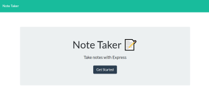
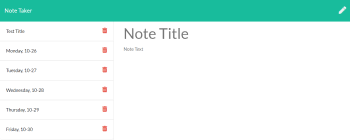
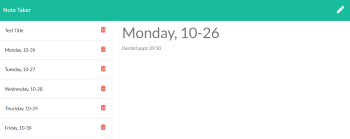
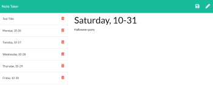

# 11-note_taker
___
## Objective
Create an application that can be used to write, save, and delete notes. This application will use an express backend and save and retrieve note data from a JSON file.
___
## Table of Contents
* [Description](#description)
* [Layout](#layout)
* [Installation](#installation)
* [Usage](#usage)
* [License](#license)
* [Contributing](#contributing)
* [Questions](#questions)
* [Application_Links_and_Images](#application_links_and_images)
## Description:
 This is a command-line app that generates a Note Taker webpage allowing a user to view notes, write new notes to save, or delete previously saved notes.
_____
## Layout:
The app will direct the user to the Note Taker (index.html) page.The user can then press the **Get Started** button, and will be re-directed to the Notes (notes.html) page. A **Note Title** is added by clicking in the text field, and adding text for a title.  **Note Text** is added by clicking in the Note Text area, and adding additional information. The added Title and Text are saved by clicking on the save icon in the upper right portion of the viewport. Notes can be viewed by clicking on the Note Title(s) located on the left column in the viewport. Notes can also be added by clicking on the pencil icon in the upper right portion of the viewport. The selected Note Title and Text are then displayed on the right column in the viewport.  Note Title/Text can be deleted by clicking the trashcan icon on the right side of the left column in the viewport.
___
## Installation
(1) Type **npm i** (install) to install all required dependencies for the app   
(2) Invoke the app by going to the server.js file, open in integrated terminal, and type: **node server.js**    
_____
## Usage
This App allows the user to write, save, and delete notes on a webpage. 
_____
## Contributing
ed-sivick, Stack Overflow, Grepper, BCS support for functionality and code syntax
_____
## Questions
If there are any questions, or if you would prefer more information concerning this app,
please contact the following person at their GitHub profile or email address below:

* [GitHub Profile](https://github.com/ed-sivick)
* ed@sivick.net
_____
## License
You can view more information concerning software licenses at the following link:

* [License](https://opensource.org/licenses/MIT)
_____
## Badges

___
## Application_Links_and_Images  
**Links:**  
Heroku link: (https://pacific-refuge-05074.herokuapp.com/)   

**Application Image Examples:** Hover the mouse over each image for a brief description.

  
  

  

  
  

  
  

  
  

  

  
  
